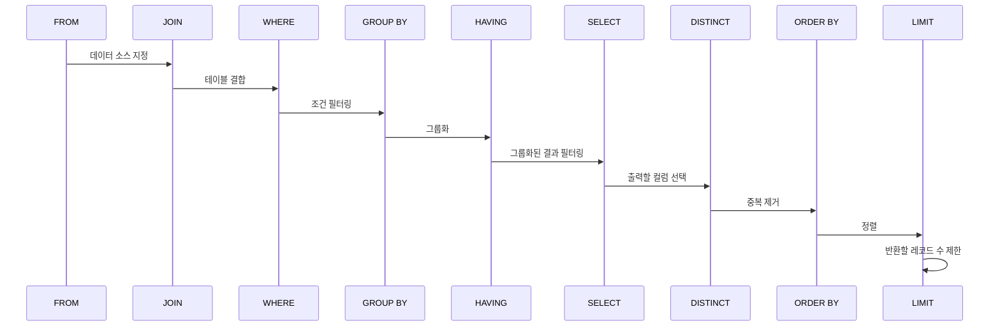

# MySQL / MariaDB

---

## MySQL vs MariaDB

- **MariaDB는 MySQL의 오픈소스 버전에서 포크(fork)된 DB**
- MySQL이 Oracle에 인수된 이후,  
  **완전한 오픈소스 유지 목적**으로 MariaDB가 등장
- 기본 문법과 사용법은 **거의 동일**
- 실무에서도 MySQL ↔ MariaDB 전환 비용 낮음

---

## Table 정의

> **테이블(Table)**  
> 데이터베이스에서 데이터를 **구조적으로 저장하는 기본 단위**

- 컬럼(column): 데이터의 속성
- 로우(row): 실제 데이터 한 건
- 스키마 설계 = 서비스 설계

---

> [!IMPORTANT]
> ### WHERE 절 먼저 쓰는 습관
>
> SQL 작성 시 **WHERE 조건부터 먼저 생각**
> 특히 `DELETE`, `UPDATE`에서 매우 중요
> ```sql
> -- ❌ 사고 나는 예
> DELETE FROM users;
> 
> -- ✅ 안전한 습관
> DELETE FROM users
> WHERE id = 1;
> ```
> **전 데이터 삭제될 수 있음!!**
---
## SQL 실행 순서
- SQL 문장은 **논리적 실행 순서**가 존재
- 실제 작성 순서와 다름

---
## Delete 전략
### Hard Delete
- 실제 데이터 삭제
- 복구 불가능
- 
### Soft Delete
- 실제 데이터 삭제 대신 **삭제 플래그**로 상태 관리
- 데이터는 남기고 삭제 표시만 함
---
## PyMySQL: Cursor 개념
- **Cursor = DB 결과를 가리키는 포인터**
- SQL 실행과 결과 조회 담당
- 기본 커서는 튜플로 반환
    ```python
    with conn.cursor() as cursor:
        cursor.execute("SELECT * FROM users")
        result = cursor.fetchall()
    ```
**DictCursor**
- 결과를 dict 형태로 반환
- 가독성 좋음
---
## Transaction & Rollback
- 여러 SQL을 하나의 작업 단위로 묶음
- 중간에 문제 생기면 전체 취소 가능
- 작업의 원자성 보장
```python
try:
    conn.begin()
    cursor.execute(sql1)
    cursor.execute(sql2)
    conn.commit()
except:
    conn.rollback()
```
