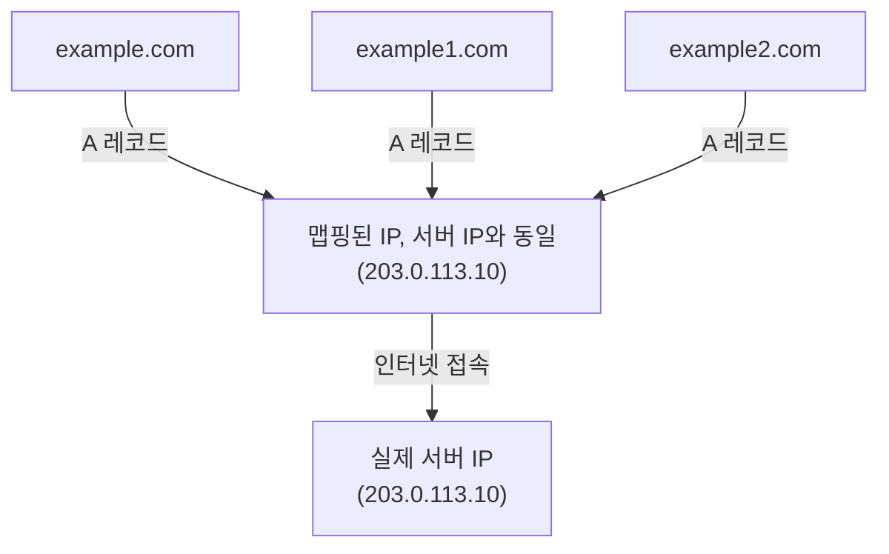
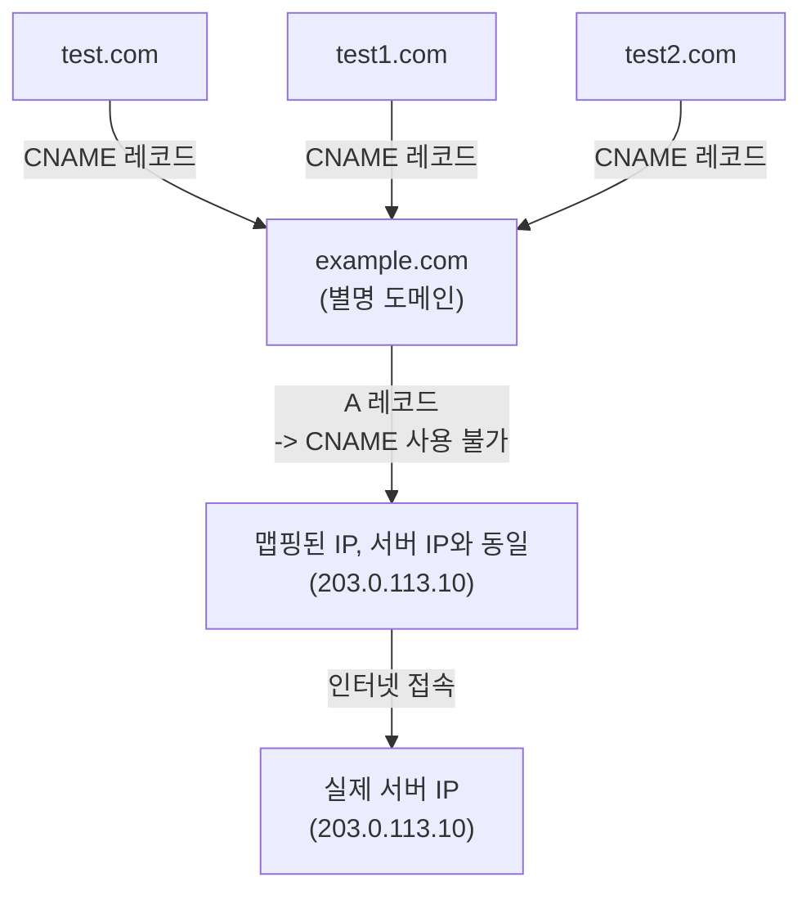

# DNS Records
- DNS Record는 **도메인에 대해 어떤 리소스로 연결할지 정의하는 정보**
> [!NOTE]
> DNS는 트래픽을 전달하지 않고, **어디로 가야 하는지 알려주는 역할**만 한다.
---
## A Record
- 도메인 이름을 IPv4 주소에 직접 맵핑
- 가장 기본이 되는 DNS 레코드

### 특징
- 도메인 → IP 주소 (직접 연결)
- 일대다/다대일 매핑 가능

### 장점
  - 빠름
    - 한 번의 DNS 조회로 IP주소 알 수 있음
### 단점
  - 서버 IP주소 수정 시 레코드도 수정 필요 
  - 하나의 서버 IP주소에 여러 도메인이 맵핑되어 있으면 관리비용 증가

---
## AAAA Record
- 도메인 이름을 IPv6 주소에 직접 맵핑
- 간단히 말해 A 레코드의 IPv6 버전
---

## CNAME
- 별명(Canonical Name) 레코드 
- 도메인을 다른 도메인 이름으로 매핑

### 특징
- 실제 IP는 A / AAAA 레코드가 담당
- CNAME은 중간 별칭 역할

### 장점
- 유연한 관리
- 서버 IP 변경 시 A 레코드만 수정
- 여러 도메인을 하나의 기준 도메인으로 관리 가능

> [!IMPORTANT] 제약 사항
> - CNAME 레코드는 다른 레코드와 함께 존재할 수 없음
> - 도메인(example.com) 에는 CNAME 사용 불가

---
## MX
- 메일 교환(Mail Exchange) 레코드
- 도메인에 대한 이메일 서버 지정
---
## TXT
- 텍스트 레코드
- 도메인에 대한 임의의 텍스트 정보 저장
- SPF, DKIM, DMARC 등 이메일 인증 및 보안에 사용
---
## NS
- 네임서버 레코드
- 해당 도메인을 관리하는 권한 있는 네임서버 지정

> [!NOTE]
> 실제 서비스에서는 A/AAAA + CNAME + TXT 조합이 가장 많이 사용된다.
> - A/AAAA: 서버에 접속하려면 무조건 필요하다
> - CNAME: 클라우드 마이그레이션이, 로드밸런서 교체 등 실제로는 IP주소가 자주 바뀐다. CNAME으로 관리하면 편리하다.
> - TXT: 이메일 인증, 도메인 소유권 증명 등 보안 용도로 사용된다.
