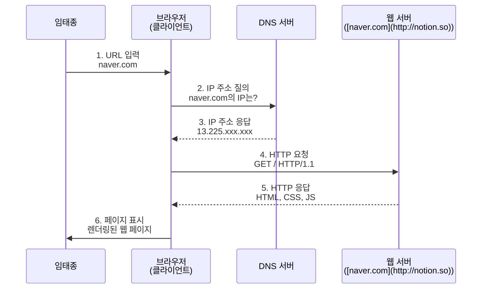
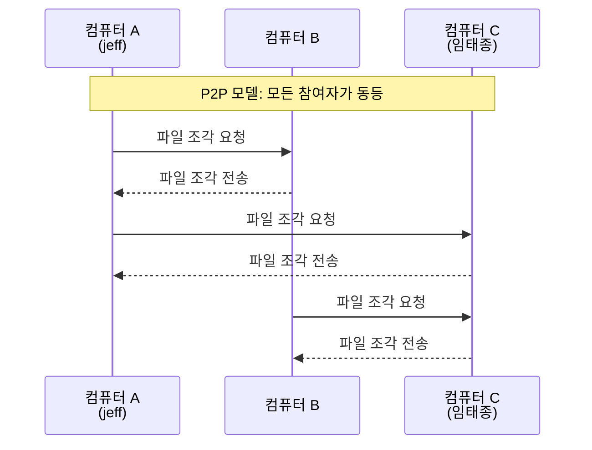

## Client-Server Model

### client

- 요청(request)을 보내는 쪽
- 브라우저, 모바일 앱 등

```python3
import requests # 요청을 보내기 위한 라이브러리 (별도 설치 필요: pip install requests)

# 1. 요청 보낼 목적지 설정 (서버 주소)
url = 'http://localhost:8000/api/user'

print(f"📡 요청 보내는 중: {url}")

# 2. GET 요청 전송 (주문 하기)
try:
    response = requests.get(url) # 지정된 URL로 GET 요청 전송

    # 3. 응답 확인 (음식 받기)
    print(f"✅ 상태 코드: {response.status_code}") # 200이면 성공
    print(f"📦 응답 데이터: {response.json()}")    # 받은 데이터 확인
    # response.json(): JSON 형식의 응답을 파이썬 딕셔너리로 변환
    
except Exception as e:
    print(f"❌ 연결 실패: {e}")
    print("서버가 켜져 있는지 확인해주세요!")
```
----
### server
- 요청을 받고, 응답(response) 하는 쪽
- 웹 서버, 데이터베이스 서버 등

  ```python3
  # server.py
  
  from http.server import HTTPServer, BaseHTTPRequestHandler
  # HTTPServer: HTTP 프로토콜을 처리하는 서버 클래스
  # BaseHTTPRequestHandler: HTTP 요청 핸들러 기본 클래스
    
  import json
  
  # 요청을 처리할 핸들러 클래스 정의 (웨이터의 역할)
  class MyHandler(BaseHTTPRequestHandler):
  
      # GET 요청이 들어왔을 때 실행되는 메서드
      def do_GET(self):
          # 1. 요청 경로 확인 (주문 내용 확인)
          if self.path == '/api/user':
              # 응답할 데이터 준비 (주방에서 요리)
              data = {
                  "name": "임태종",
                  "nickname": "jeff",
                  "role": "Instructor"
              }
  
              # 2. 응답 헤더 작성 (영수증 작성)
              self.send_response(200)  # 200 OK: 성공적으로 처리함
              self.send_header('Content-Type', 'application/json')  # JSON 형식임을 명시
              self.end_headers()  # 헤더 작성 끝
  
              # 3. 응답 바디 작성 및 전송 (음식 서빙)
              # 데이터를 JSON 문자열로 변환하고, 바이트로 인코딩하여 전송
              self.wfile.write(json.dumps(data, ensure_ascii=False).encode('utf-8'))
          else:
              # 정의되지 않은 경로로 요청이 온 경우 (없는 메뉴 주문)
              self.send_response(404)  # 404 Not Found
              self.end_headers()
  
  
  # 메인 실행 블록
  
  if __name__ == '__main__':
      # 서버 주소와 포트 설정 ([localhost:8000](http://localhost:8000))
      server_address = ('', 8000)
  
      # 서버 생성 (가게 오픈 준비)
      httpd = HTTPServer(server_address, MyHandler)
  
      print(f"🚀 Server is running on port 8000...")
      print(f"   [http://localhost:8000/api/user](http://localhost:8000/api/user) 로 접속해보세요.")
  
      # 서버 실행 및 대기 (손님이 올 때까지 무한 대기)
      httpd.serve_forever()
      # 서버를 무한 대기 상태로 실행 (종료 전까지 계속 실행됨)
  ```
---
### e.g.) HTTP Request/Response Flow


### 장점
- 중앙 관리
- 보안 강화
- 데이터 일관성 유지

### 단점
- 단일장애지점(SPOF) -> 서버가 다운되면 전체 서비스 중단
- 네트워크 의존성
- 서버 부하 집중
> [!IMPORTANT]
> 로드밸런서, 과대 프로비저닝, 이중화로 SPOF 완화 가능

---

## P2P (Peer-to-Peer) Model
- 모든 노드가 클라이언트이자 서버 역할
- Always-on server가 아닌 dynamic 참여자
- Peer간 직접 통신
- **Self-cability**
  - peer들이 늘어날수록 성능 향상
  - client도 늘어나지만 server도 늘어나기 때문


---
### Client-Server vs. P2P
| 구분 | 클라이언트-서버 | P2P |
|---|---|---|
| 구조 | 중앙 집중형 | 분산형 |
| 역할 | 클라이언트와 서버 구분 명확 | 모든 노드가 클라이언트이자 서버 |
| 예시 | 웹사이트, 이메일, 온라인 게임 | 토렌트, 블록체인 |
| 장애 대응 | 서버 장애 시 서비스 중단 | 일부 노드 장애에도 서비스 유지 |

<br><br>
reference: <br>
https://github.com/ej31