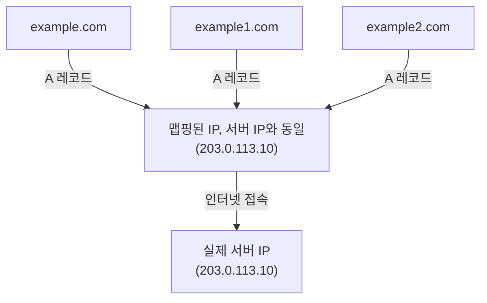
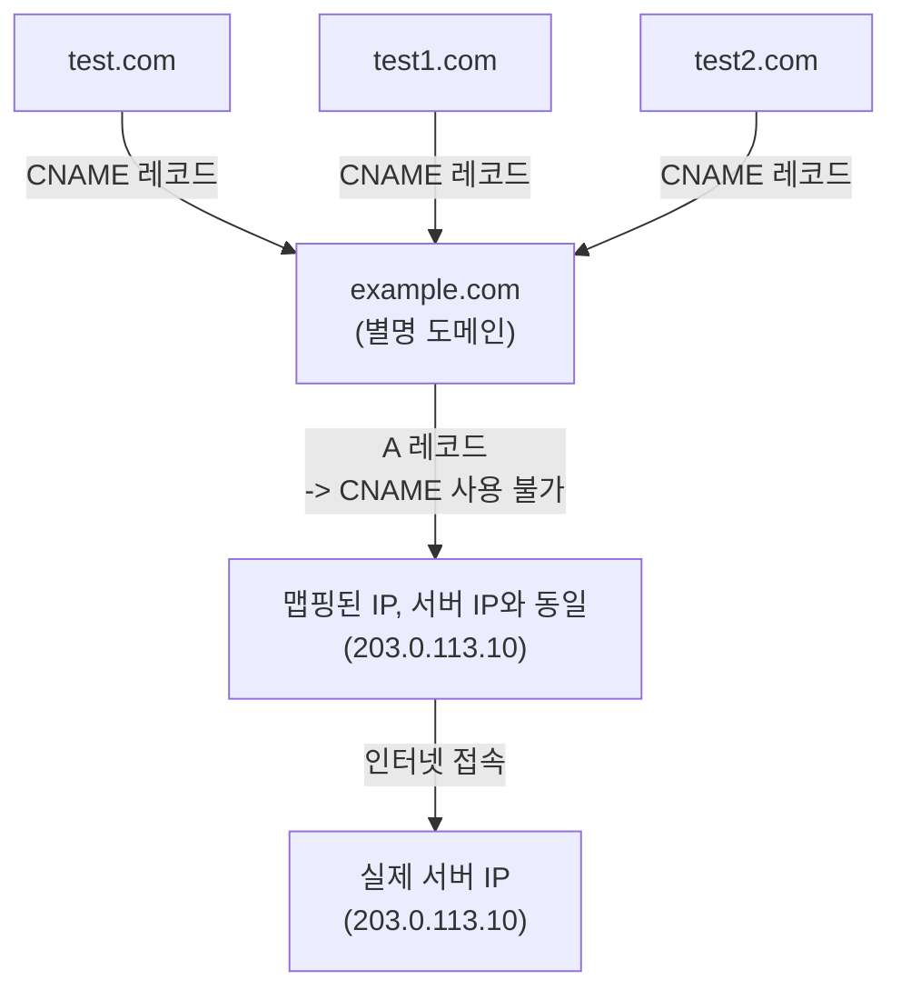

# Proxy

## Proxy란?
- 직역하면 '대리'라는 의미
- 서버와 클라이언트 사이의 중계 역할 자체를 Proxy라고 하고, 이를 사용하는 장치 또는 응용 프로그램을 프록시 서버라고 함.

## Foward Proxy

- 일반적인 프록시 형태
- 클라이언트 바로 뒤에 proxy 위치 (클라이언트와 같은 망에 존재)
- 클라이언트가 같은 내부망에 있는 프록시 서버를 통해 외부 네트워크에 접속하는 방식
- e.g.) 특정 사이트 접속 차단
  - 요청: www.youtube.com
  - 프록시 서버가 차단된 사이트임을 인지하고 접속 불가 응답 반환

### 장점
- 캐싱을 통한 서버 부하 감소 -> 성능 향상
- 서버 측에 클라이언트 정보를 숨길 수 있음

## Reverse Proxy

- 웹서버나 WAS 바로 앞에 proxy 위치 (서버와 같은 망에 존재)
- e.g.) 로드밸런서

### 장점
- 로드 밸런싱: 여러 대의 서버에 트래픽 분산
- 클라이언트 측에 서버 정보를 숨길 수 있음
- 캐싱 -> 성능 향상

> [!NOTE]
> Web Server vs. WAS
> **Web Server**
> - 정적 리소스(HTML, CSS, JS 등) 전달
> - 파일을 그대로 전달해 빠르고 가벼움
> - 이미 만들어진 음식 진열대에서 꺼내주는 것
> - 대표적인 예: Apache, Nginx
> 
> **WAS (Web Application Server)**
> - 동적 리소스(사용자 요청에 따라 생성되는 페이지) 처리
> - 요리사가 주문받아 음식을 만들어주는 것
> - 대표적인 예: Tomcat, JBoss, WebLogic
> 
> 실제 서비스에서는 Web Server와 WAS가 함께 사용됨

# DNS Records
- DNS Record는 **도메인에 대해 어떤 리소스로 연결할지 정의하는 정보**
> [!NOTE]
> DNS는 트래픽을 전달하지 않고, **어디로 가야 하는지 알려주는 역할**만 한다.
---
## A
- 도메인 이름을 IPv4 주소에 직접 맵핑
- 가장 기본이 되는 DNS 레코드

### 특징
- 도메인 → IP 주소 (직접 연결)
- 일대다/다대일 매핑 가능

### 장점
  - 빠름
    - 한 번의 DNS 조회로 IP주소 알 수 있음
### 단점
  - 서버 IP주소 수정 시 레코드도 수정 필요 
  - 하나의 서버 IP주소에 여러 도메인이 맵핑되어 있으면 관리비용 증가

---
## AAAA
- 도메인 이름을 IPv6 주소에 직접 맵핑
- 간단히 말해 A 레코드의 IPv6 버전
---

## CNAME
- 별명(Canonical Name) 레코드 
- 도메인을 다른 도메인 이름으로 매핑

### 특징
- 실제 IP는 A / AAAA 레코드가 담당
- CNAME은 중간 별칭 역할

### 장점
- 유연한 관리
- 서버 IP 변경 시 A 레코드만 수정
- 여러 도메인을 하나의 기준 도메인으로 관리 가능

> [!IMPORTANT]
> **제약 사항**
> - CNAME 레코드는 다른 레코드와 함께 존재할 수 없음
> - 도메인(example.com) 에는 CNAME 사용 불가

---
## MX
- 메일 교환(Mail Exchange) 레코드
- 도메인에 대한 이메일 서버 지정
---
## TXT
- 텍스트 레코드
- 도메인에 대한 임의의 텍스트 정보 저장
- SPF, DKIM, DMARC 등 이메일 인증 및 보안에 사용
---
## NS
- 네임서버 레코드
- 해당 도메인을 관리하는 권한 있는 네임서버 지정

> [!NOTE]
> 실제 서비스에서는 A/AAAA + CNAME + TXT 조합이 가장 많이 사용된다.
> - A/AAAA: 서버에 접속하려면 무조건 필요
> - CNAME: 클라우드 마이그레이션이, 로드밸런서 교체 등 실제로는 IP주소가 자주 바뀐다. CNAME으로 관리하면 편리
> - TXT: 이메일 인증, 도메인 소유권 증명 등 보안 용도로 사용
